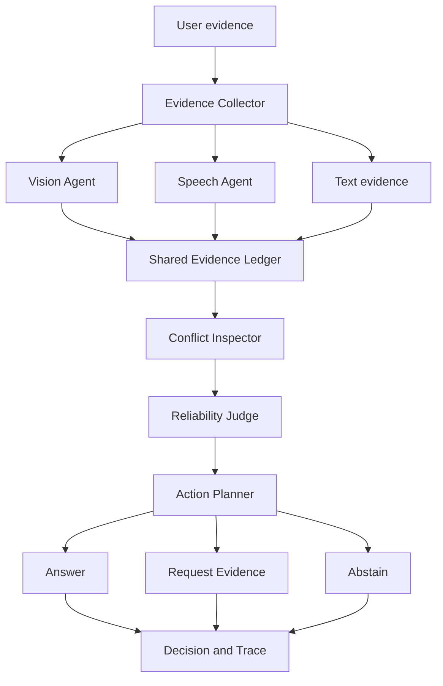

# 🔎 MOSAIC-R: Active Evidence Agent

[](https://github.com/gouthambilluri02/mosaic-r-active-evidence-agent/actions/workflows/test.yml)


> A privacy focused multimodal agent that evaluates text, image, and voice evidence before deciding whether to answer, request additional evidence, or abstain.

## Live Demo

**Hugging Face Space:** https://huggingface.co/spaces/gouthambilluri02/mosaic-r-active-evidence-agent

The demo is public and free to use. Image captioning and speech recognition run inside the visitor's browser, so the application does not require an API key or an inference server.

## Overview

Many AI applications are designed to always produce an answer. That becomes unreliable when evidence is incomplete, low quality, or contradictory. I built MOSAIC-R to explore a different agentic pattern: the system first judges whether it has enough trustworthy evidence to act.

The application accepts written claims, images, and voice notes. Specialized perception agents convert each input into structured evidence. A conflict inspector compares the claims, a reliability judge scores the available evidence, and an action planner chooses one of three outcomes:

1. Answer when the evidence is sufficiently consistent.
2. Request the smallest useful follow up when the evidence is incomplete or conflicting.
3. Abstain when a reliable decision cannot be made.

Every step is returned in an inspectable decision trace instead of being hidden inside a single model response.

## Why I Built This

While working with RAG and agentic workflows, I noticed that most demos focus on tool calling and answer generation. Fewer projects treat uncertainty and conflicting evidence as first class parts of the workflow.

I wanted to build a small but complete system that demonstrates three ideas:

* Multiple specialized agents can collaborate around a shared evidence state.
* An agent should actively request better information instead of guessing.
* Important decisions should be reproducible, testable, and explainable.

## Features

* Text, image, and voice evidence intake
* In browser image captioning using a quantized vision model
* In browser speech recognition using Whisper Tiny
* Cross source conflict detection
* Reliability scoring with multimodal coverage
* Answer, request evidence, and abstain decisions
* Next best evidence planning
* Human readable and machine readable execution traces
* Controlled scenarios for conflict, missing evidence, and agreement
* Python and JavaScript policy tests
* Automatic testing and Hugging Face deployment through GitHub Actions
* No API key and no paid infrastructure

## Architecture



## Agent Responsibilities

| Agent | Responsibility |
|---|---|
| Evidence Collector | Normalizes text, image captions, audio transcripts, confidence, and source information |
| Vision Agent | Converts an uploaded image into a grounded caption |
| Speech Agent | Transcribes voice evidence into text |
| Conflict Inspector | Finds opposing claims from independent sources |
| Reliability Judge | Combines confidence, modality coverage, conflicts, and adapter errors |
| Action Planner | Selects answer, request evidence, or abstain |
| Supervisor | Produces the final result and complete execution trace |

## My Engineering Approach

I separated perception from decision making. The Hugging Face models handle image and audio understanding, while an explicit policy handles conflict detection, reliability scoring, and action selection.

I chose this design because it gives me deterministic behavior for the safety critical part of the workflow. The same evidence produces the same decision, thresholds can be tested directly, and a reviewer can inspect why the agent acted.

I also used Web Workers so model inference does not freeze the interface. Quantized models run through WASM and are cached by the browser after the first download. This allowed me to keep the demo completely free while preserving user privacy.

## Decision Policy

```text
Collect evidence
      ↓
Extract claims and confidence
      ↓
Check conflicts and missing signals
      ↓
Calculate reliability
      ↓
Answer | Request evidence | Abstain
      ↓
Return evidence ledger and execution trace
```

The current policy uses an answer threshold of `0.72` and an abstain threshold of `0.25`. Conflicting sources and perception errors reduce the reliability score. These values are prototype defaults and are intentionally visible for future calibration.

## Technology Stack

### Frontend

* HTML5
* CSS3
* JavaScript ES modules
* Web Workers

### AI and Multimodal Processing

* Hugging Face Transformers.js
* `Xenova/vit-gpt2-image-captioning`
* `Xenova/whisper-tiny.en`
* ONNX Runtime Web
* WASM inference

### Testing and Deployment

* Node test runner
* Python unittest
* GitHub Actions
* Hugging Face Static Spaces

## Project Structure

```text
mosaic-r-active-evidence-agent/
├── index.html                 Application interface
├── styles.css                Responsive visual design
├── app.mjs                   UI orchestration and result rendering
├── agent.mjs                 Browser decision policy and agent workflow
├── worker.mjs                Vision and speech model worker
├── app.py                    Python reference application
├── src/mosaic_r/             Python reference policy and orchestration
├── tests/                    JavaScript and Python tests
├── scripts/evaluate.py       Reproducible scenario evaluation
└── .github/workflows/        Test and deployment automation
```

## Try These Scenarios

### Conflicting Evidence

```text
Text: The package arrived damaged and the corner is torn.
Image evidence: The package appears intact with no damage visible.
Expected action: Request additional evidence.
```

### Missing Evidence

```text
Text: The reimbursement was approved, but the receipt is missing.
Expected action: Request the missing supporting document.
```

### Consistent Evidence

```text
Text: The package is damaged and has a cracked side.
Image evidence: A damaged package with a cracked side.
Expected action: Answer with the supporting evidence trail.
```

The live application includes these as controlled scenarios, so the agentic workflow can be reviewed without downloading a model.

## Run Locally

Clone the repository:

```bash
git clone https://github.com/gouthambilluri02/mosaic-r-active-evidence-agent.git
cd mosaic-r-active-evidence-agent
```

Start a local static server:

```bash
python -m http.server 7860
```

Open:

```text
http://localhost:7860
```

The first image or voice analysis downloads the required quantized model. Controlled scenarios work immediately.

## Run the Tests

JavaScript policy tests:

```bash
node --test tests/agent.test.mjs
```

Python reference tests and scenario evaluation:

```bash
python -m unittest discover -s tests -v
python scripts/evaluate.py
```

## Key Design Decisions

* I used specialized agents rather than one large prompt so every responsibility is visible and testable.
* I kept the final decision policy deterministic so behavior can be reproduced during evaluation.
* I used local browser inference to avoid API costs and protect uploaded evidence.
* I included controlled scenarios so anyone can understand the workflow immediately.
* I exposed the JSON trace so engineers can inspect the intermediate decisions, not only the final output.

## Current Limitations

* Conflict detection currently covers a focused vocabulary of claim types.
* The reliability thresholds have not yet been calibrated on a large benchmark.
* Image captions describe the full image and do not cite individual regions.
* Audio transcripts do not yet include timestamp level citations.
* Browser model loading time depends on the visitor's network and device.

## Future Enhancements

* Calibrate uncertainty thresholds using a labeled evaluation set
* Add semantic contradiction detection beyond fixed claim vocabulary
* Add image region and audio timestamp citations
* Introduce failure injection and automatic recovery tests
* Build a benchmark dashboard with regression gates
* Add human feedback for decision review and threshold tuning

## Responsible Use

MOSAIC-R is a personal research and portfolio prototype. It should not be used for medical, legal, financial, employment, or safety critical decisions.

## Author

**Goutham Billuri**

AI and ML Engineer

Interested in agentic AI, multimodal systems, reliable AI workflows, RAG, and production AI platforms.

## License

MIT License
